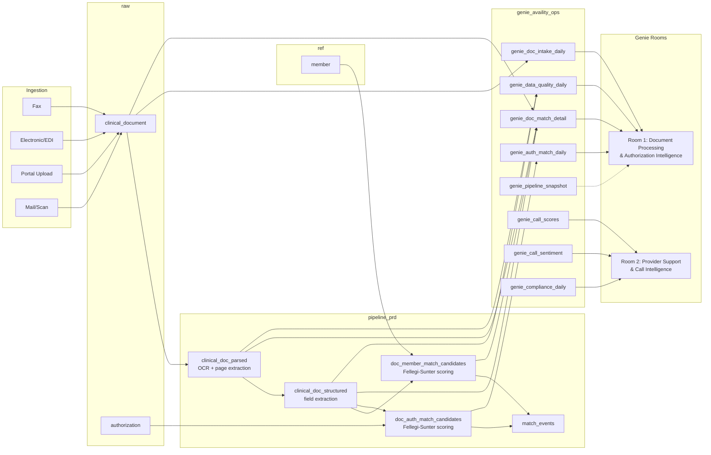

# Clinical Document Intelligence Genie Room

A national health information network processes billions of clinical, administrative, and financial transactions per year -- eligibility checks, claims, prior authorizations, remittance advice -- connecting health plans, providers, and health IT vendors through a single multi-payer portal and API layer. The core operational challenge: clinical documents (faxes, prior auth forms, lab results, discharge summaries) arrive from thousands of sources and must be parsed, identity-matched to members and authorizations, and routed to the correct payer workflow -- accurately, at scale, under SLA. This demo builds two Databricks Genie Rooms that let ops leaders and call center supervisors ask natural-language questions against curated views of the document processing pipeline and provider support call data.

## Architecture



## Prerequisites

Works on **any Databricks workspace** with Unity Catalog enabled. If you don't have one, sign up for [Databricks Free Edition](https://www.databricks.com/learn/free-edition) — no credit card, single-user workspace with a serverless SQL warehouse pre-provisioned.

- **A Databricks workspace** with Unity Catalog enabled
- **Serverless SQL warehouse** (or any SQL warehouse with access to your catalog)
- A **Unity Catalog catalog** you can write to (Free Edition gives you a `workspace` catalog by default)
- Python 3.10+ with `faker`, `pandas`, `numpy` installed (for data generation — generates 12 source tables)

## Quick Start

### Option A: One-click notebook (recommended)

Import `notebooks/setup_genie_rooms.py` into your Databricks workspace and run all cells. It handles everything: schema creation, synthetic data generation, view deployment, and Genie Room provisioning. Set the `catalog` and `warehouse_id` widgets at the top.

### Option B: Step-by-step

1. **Generate synthetic data** -- Run the data generator to populate all source tables:
   ```bash
   pip install faker pandas numpy
   # Edit the config section in generate_all.py to set your catalog/schema names
   python data_generator/generate_all.py
   ```

2. **Create schemas** -- Execute the schema DDL against your warehouse:
   ```sql
   -- Run sql/00_create_schemas.sql in a Databricks SQL editor
   ```

3. **Create Genie views** -- Deploy all 8 curated views + 3 metric views:
   ```sql
   -- Run sql/01_create_genie_views.sql in a Databricks SQL editor
   ```

4. **Annotate the source tables** -- Propagate column-level comments to the underlying `pipeline_prd.*` tables (improves downstream tooling and any future view that joins these tables):
   ```sql
   -- Run sql/02_source_table_comments.sql
   ```

5. **Wire up multi-payer access control** -- Create the access mapping table and the row-filter function:
   ```sql
   -- Run sql/03_payer_access_filter.sql
   ```

6. **Create Genie Rooms** -- Two options:

   **From a workstation (CLI):**
   ```bash
   python genie_config/create_rooms.py
   ```
   This is idempotent and preserves existing curation.

   **From the workspace (notebooks, no DABs needed):**
   - `notebooks/create_room1_doc_processing.py` — provisions Room 1 with full curation in a single API call.
   - `notebooks/create_room2_provider_support.py` — provisions Room 2 the same way.

   Each notebook reads its `genie_config/roomN_curation.json`, rewrites table identifiers to the catalog/schema you set in the widgets, and `POST`s the room with `serialized_space` so it ships fully curated — no manual UI import. Re-running is a no-op unless you set `refresh_existing=yes`.

7. **Validate** -- Open each room URL and ask a test question (e.g., "How many documents came in yesterday?" or "Which agents have the lowest compliance scores?").

### Maintaining the rooms over time

Each room's full configuration — instructions, sample queries, joins, filters, expressions, measures, benchmarks — is exported to JSON in `genie_config/`:

```bash
python genie_config/export_rooms.py
```

Run this after any UI edit so the repo stays the source of truth. The exported JSON files (`room1_curation.json`, `room2_curation.json`) are the canonical reference for what each room should contain.

A longer-form domain reference for both rooms (Fellegi-Sunter primer, channel definitions, risk-tier ladder, cross-room investigative patterns) lives at `docs/genie_knowledge_store.md`.

## Schema Inventory

| # | View | Source | Purpose |
|---|------|--------|---------|
| 1 | `genie_doc_intake_daily` | `raw.clinical_document` | Daily document intake volume by type/channel with day-over-day trends, rolling averages, and spike detection |
| 2 | `genie_doc_match_detail` | `pipeline_prd.doc_member_match_candidates` + 3 joins | Per-document match status with Fellegi-Sunter weights, risk tier, extraction flags, and contextual rankings |
| 3 | `genie_auth_match_daily` | `pipeline_prd.doc_auth_match_candidates` | Daily authorization match volumes with week-over-week trends and match class distribution |
| 4 | `genie_data_quality_daily` | `pipeline_prd.clinical_doc_parsed` + `clinical_doc_structured` | Daily parsing/extraction quality metrics with rolling trends and degradation detection |
| 5 | `genie_pipeline_snapshot` | `dashboard_prd.v_pipeline_kpis` | Current-state pipeline KPIs in long format for easy Genie querying |
| 6 | `genie_call_scores` | `transcript_intel_sdp.mv_call_scores` | Call quality scores with agent rankings, percentiles, and rolling trends |
| 7 | `genie_call_sentiment` | `transcript_intel_sdp.gold_call_summaries_sentiment` | AI-generated call summaries with sentiment analysis (overall, start, end, trajectory) |
| 8 | `genie_compliance_daily` | `transcript_intel_sdp.mv_compliance_outcomes` | Daily compliance rates with rolling trends, WoW comparison, agency rankings, and consecutive-day streaks |

### Metric Views (AI/BI)

Pre-defined measures and dimensions for Genie aggregate queries:

| # | Metric View | Source View | Key Measures |
|---|-------------|-------------|--------------|
| 9 | `mv_doc_intake_metrics` | `genie_doc_intake_daily` | total_documents, unreadable_rate_pct, channel volumes, spike_day_count |
| 10 | `mv_doc_match_metrics` | `genie_doc_match_detail` | match_rate_pct, avg_match_weight, high_risk_pct, extraction_completeness_pct |
| 11 | `mv_call_quality_metrics` | `genie_call_scores` | avg_call_score, compliance_rate_pct, high_risk_pct, escalation_rate_pct |

## Genie Rooms

### Room 1: Document Processing & Authorization Intelligence

Audience: Ops leaders, utilization management staff, product managers.

Covers document intake volume, OCR quality, Fellegi-Sunter match outcomes, authorization match trends, and pipeline KPIs. Five curated views with window functions for trend analysis, spike detection, and risk tiering.

**URL**: `genie_config/create_rooms.py` (or the all-in-one notebook) prints the room URL on your workspace after provisioning. URLs follow the pattern `https://<your-workspace>.cloud.databricks.com/genie/rooms/<room_id>`.

### Room 2: Provider Support & Call Intelligence

Audience: Call center supervisors, QA analysts, provider relations.

Covers call quality scoring, agent performance rankings, AI-generated sentiment analysis, and compliance tracking with consecutive-day streak detection.

**URL**: same — printed by `create_rooms.py` / the notebook on your own workspace.

## Teardown

All objects live in a single schema. To remove everything without affecting source tables, pipelines, or dashboards:

```sql
-- Replace <catalog> with the catalog you set in the notebook / scripts.
DROP SCHEMA <catalog>.genie_availity_ops CASCADE;
```

## Repo Structure

```
.
├── README.md
├── notebooks/
│   ├── setup_genie_rooms.py             # All-in-one Databricks notebook (import & run)
│   ├── create_room1_doc_processing.py   # Room 1 only — fully curated provisioning
│   └── create_room2_provider_support.py # Room 2 only — fully curated provisioning
├── data_generator/
│   └── generate_all.py             # Standalone synthetic data generator
├── docs/
│   └── genie_knowledge_store.md    # Domain reference (jargon, tiers, cross-room patterns)
├── sql/
│   ├── 00_create_schemas.sql       # Schema DDL
│   ├── 01_create_genie_views.sql   # 8 Genie views + 3 metric views
│   ├── 02_source_table_comments.sql # Column comments on pipeline_prd tables
│   └── 03_payer_access_filter.sql  # Multi-payer mapping table + row-filter function
└── genie_config/
    ├── create_rooms.py             # Idempotent Genie Room provisioning (preserves curation)
    ├── export_rooms.py             # Pull live curation back to JSON (run after UI edits)
    ├── room1_curation.json         # Full curation export for Room 1 (source of truth)
    └── room2_curation.json         # Full curation export for Room 2 (source of truth)
```
